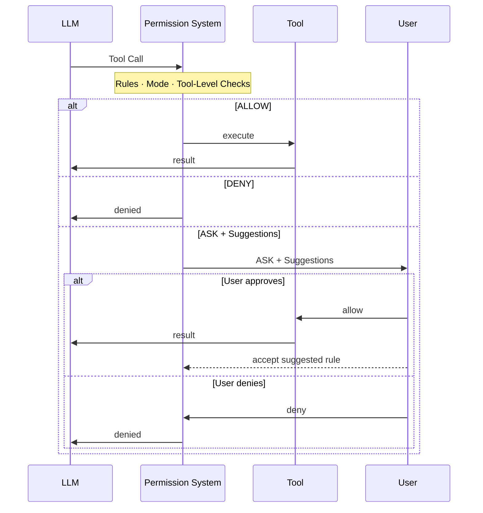

The permission system intercepts every tool call an agent makes and produces one of three decisions: **allow** the tool to execute, **deny** it, or **ask the user** for confirmation.

The decision is driven by three components working together, each covered in its own page:

| Component | What It Does | Where It Comes From |
|-----------|--------------|---------------------|
| [Permission Rule](/versions/2.0.8/en/building-blocks/permission-system/permission-rule) | Explicit allow/deny/ask patterns per tool and call, evaluated with highest priority | Pre-configured in `PermissionContext`, or added at runtime when the user accepts a suggested rule during an ASK |
| [Permission Mode](/versions/2.0.8/en/building-blocks/permission-system/permission-mode) | A global policy that decides which decision points are active and the default handling for calls nothing else resolves | Set at configuration time, switchable at runtime |
| [Tool-Level Checks](/versions/2.0.8/en/building-blocks/permission-system/tool-check) | Dynamic analysis the tool itself performs on the actual inputs: read-only detection, dangerous-path protection, working-directory auto-allow | Implemented in each tool's `check_read_only()` / `check_permissions()` |

The sequence diagram below shows how a tool call flows through the system. An ASK decision surfaces to the user together with auto-generated **suggested rules**; accepting one persists it, so future identical calls are handled without prompting:



## Decision Matrix

Every call walks the same decision points from top to bottom, and the first decisive answer wins. The matrix below shows, for each mode, what each decision point produces. A "skipped" cell means the mode does not consult that point at all; when a point stays silent (no rule matches, or the tool returns `PASSTHROUGH`), evaluation continues downward until the fallback:

| Decision Point | `DEFAULT` | `ACCEPT_EDITS` | `EXPLORE` | `BYPASS` | `DONT_ASK` |
|----------------|-----------|----------------|-----------|----------|------------|
| ① Deny rule match | DENY | DENY | DENY | DENY | DENY |
| ② Ask rule match | ASK | ASK | ASK | ASK | DENY |
| ③ Read-only fast path | ALLOW | ALLOW | ALLOW | ALLOW | ALLOW |
| ④ Tool `check_permissions` | ALLOW / DENY / safety ASK | Same as `DEFAULT`, plus working-directory edits → ALLOW | skipped | ALLOW / DENY (safety ASKs skipped) | Same as `ACCEPT_EDITS`, but any ASK → DENY |
| ⑤ Allow rule match | ALLOW | ALLOW | skipped | ALLOW | ALLOW |
| ⑥ Fallback | ASK | ASK | DENY | ALLOW | DENY |

How to read the rows:

- **① / ② / ⑤ Rules**: user-configured patterns, evaluated deny → ask first, allow late. Deny and ask rules are honored in **every** mode (in `DONT_ASK`, an ask rule converts to DENY because no user is available to answer).
- **③ Read-only fast path**: if the specific invocation is factually read-only (`check_read_only(tool_input)`), it is auto-allowed in every mode. The check is per-invocation, not a static tool flag: `git status` passes, a Bash command that writes files does not, and a command flagged with injection risk is never treated as read-only.
- **④ Tool `check_permissions`**: the tool inspects the invocation and returns ALLOW, DENY, ASK, or PASSTHROUGH. A **safety ASK** (`bypass_immune=True`) cannot be silenced by allow rules in ⑤; a regular ASK can. Working-directory auto-allow for edits happens here.
- **⑥ Fallback**: the mode's default when nothing above decided, which gives each mode its personality: prompt (`DEFAULT` / `ACCEPT_EDITS`), refuse (`EXPLORE` / `DONT_ASK`), or trust (`BYPASS`).

See [Permission Mode](/versions/2.0.8/en/building-blocks/permission-system/permission-mode) for each mode's full decision flowchart, and the [safety check contract](/versions/2.0.8/en/building-blocks/permission-system/tool-check#safety-check-contract) for the exact per-mode handling of safety ASKs.

## Common Scenarios

The following examples show how to configure `AgentState.permission_context` for common deployment scenarios. Each recipe combines a mode with rules to match a specific use case.

<CodeGroup>
```python Read-only exploration
# EXPLORE mode: agent can freely use read-only tools (Read, Grep,
# Glob) and read-only bash commands (`ls`, `git status`, `cat`, ...).
# Any modification (Write, Edit, or non-read-only bash command) is
# denied automatically.
agent = Agent(
    name="explorer",
    system_prompt="...",
    model=model,
    state=AgentState(
        permission_context=PermissionContext(mode=PermissionMode.EXPLORE)
    ),
)
```

```python Unattended automation
from agentscope.permission import PermissionRule, PermissionBehavior

agent = Agent(
    name="ci_agent",
    system_prompt="...",
    model=model,
    state=AgentState(
        permission_context=PermissionContext(
            mode=PermissionMode.DONT_ASK,
            allow_rules={
                "Bash": [
                    PermissionRule(tool_name="Bash", rule_content="npm run:*",
                                   behavior=PermissionBehavior.ALLOW, source="project"),
                    PermissionRule(tool_name="Bash", rule_content="git commit:*",
                                   behavior=PermissionBehavior.ALLOW, source="project"),
                ],
            },
        )
    ),
)
# Only explicitly allowed commands run; everything else (including
# safety ASKs like `rm -rf /` or writes to ~/.bashrc) is converted
# to DENY. Prefer DONT_ASK over BYPASS for unattended runs: it keeps
# the tools' safety net while still never prompting the user.
```

```python BYPASS with explicit guardrails
# BYPASS skips tools' safety ASKs by design, so deny rules become the
# only guardrail. Always pair BYPASS with deny rules for the paths
# and commands you want to protect.
agent = Agent(
    name="my_agent",
    system_prompt="...",
    model=model,
    state=AgentState(
        permission_context=PermissionContext(
            mode=PermissionMode.BYPASS,
            deny_rules={
                "Bash": [
                    PermissionRule(tool_name="Bash", rule_content="rm:*",
                                   behavior=PermissionBehavior.DENY, source="userSettings"),
                    PermissionRule(tool_name="Bash", rule_content="git push:*",
                                   behavior=PermissionBehavior.DENY, source="userSettings"),
                ],
                "Write": [
                    PermissionRule(tool_name="Write", rule_content="**/.bashrc",
                                   behavior=PermissionBehavior.DENY, source="userSettings"),
                    PermissionRule(tool_name="Write", rule_content="**/.ssh/**",
                                   behavior=PermissionBehavior.DENY, source="userSettings"),
                ],
            },
        )
    ),
)
# Everything allowed except the deny-listed commands and paths.
# Without these deny rules, BYPASS would let the agent rm anything,
# git push anywhere, or overwrite ~/.bashrc: that is by design.
```
</CodeGroup>

## Next Steps

<CardGroup cols={2}>
  <Card title="Permission Mode" icon="sliders" href="/versions/2.0.8/en/building-blocks/permission-system/permission-mode">
    Pick a global policy and see each mode's full decision flow.
  </Card>
  <Card title="Permission Rule" icon="list-check" href="/versions/2.0.8/en/building-blocks/permission-system/permission-rule">
    Write allow/deny/ask patterns and accept suggested rules at runtime.
  </Card>
  <Card title="Tool-Level Checks" icon="magnifying-glass" href="/versions/2.0.8/en/building-blocks/permission-system/tool-check">
    Read-only detection, dangerous paths, and custom safety checks.
  </Card>
  <Card title="Tool" icon="wrench" href="/versions/2.0.8/en/building-blocks/tool/overview">
    The toolkit that registers the tools these permissions govern.
  </Card>
</CardGroup>
