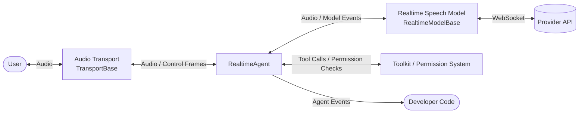

In the speech-to-speech implementation, audio flows straight in and out of one end-to-end speech model, which handles recognition, understanding, and synthesis internally. Compared with turn-based pipelines, it does not wait for the user to finish before running each stage, so latency stays low, tone and emotion survive the round trip, and the user can interrupt at any time.

AgentScope implements this through `RealtimeAgent`, which supports:

- **Turn detection**: let the provider API decide when the user has finished, or plug in a local VAD and decide yourself
- **Barge-in**: the user speaking cuts off the current reply, and the context keeps only what the user actually heard; your code can interrupt as well
- **Tool calling with user confirmation**: works with `Toolkit` and the permission system, and the audio stream keeps running while the user decides
- **Text input**: send text during a voice conversation, on models that accept text
- **Automatic reconnection**: after the provider API closes a session on idle or timeout, the next input reconnects and restores the conversation
- **Turn aggregation**: merge sentences split by a pause, and drop acknowledgements that carry no content

The table below lists the supported provider APIs and models. Each model class takes the credential of the API it belongs to, exactly like every other model in AgentScope:

| Provider API | Model Class | Models |
|--------------|-------------|--------|
| DashScope (Qwen-Omni) | `DashScopeRealtimeModel` | `qwen3.5-omni-plus-realtime`<br/>`qwen3.5-omni-flash-realtime`<br/>`qwen3-omni-flash-realtime`<br/>`qwen-omni-turbo-realtime` |
| DashScope (Qwen-Audio-3.0) | `DashScopeAudioRealtimeModel` | `qwen-audio-3.0-realtime-plus`<br/>`qwen-audio-3.0-realtime-flash` |
| OpenAI Realtime | `OpenAIRealtimeModel` | `gpt-realtime-2.1`<br/>`gpt-realtime-2.1-mini`<br/>`gpt-realtime-2`<br/>`gpt-realtime-1.5` |
| Gemini Live | `GeminiRealtimeModel` | `gemini-3.1-flash-live-preview`<br/>`gemini-2.5-flash-native-audio-preview-12-2025` |
| xAI Grok Voice | `XAIRealtimeModel` | `grok-voice-latest`<br/>`grok-voice-think-fast-2.0` |

<Tip>
Calling `list_models()` on a model class returns the [model cards](/versions/2.0.8/en/building-blocks/model/overview#what-is-modelcard) of every model under that API, carrying its sample rates, context limits, and available voices, ready to render a model selector in the frontend.
</Tip>

## Core Concepts

A speech-to-speech agent is built from three components:

- Audio transport (`TransportBase`): where sound comes from and goes to, such as a local sound card or a browser
- Realtime speech model (`RealtimeModelBase`): the session with the provider API, translating protocol messages into uniform model events
- `RealtimeAgent`: sits between the two, tracking conversation turns and handling barge-in, tool calls, and event output

The diagram below shows how audio and events move between them:



Each component owns a distinct set of responsibilities:

| Component | Responsible for |
|-----------|-----------------|
| `RealtimeAgent` | Splitting turns, barge-in and context truncation, tool calls and user confirmation, emitting agent events, reconnecting after the model session drops |
| Realtime speech model (`RealtimeModelBase`) | Maintaining the WebSocket session, translating protocol messages into uniform model events, declaring sample rates and capabilities |
| Audio transport (`TransportBase`) | Capture and playback, tracking playout progress, fading out on barge-in, turning the client's control frames into calls on the agent |

Both the model and the transport extend from a base class, so you can adapt a new provider API or connect a different client such as a browser.

## Quick Start

Start by installing the realtime extra, which brings in the WebSocket client and the local sound card library:

```bash Install the realtime dependencies
pip install "agentscope[realtime]"
```

<Note>
The sound card library `sounddevice` depends on PortAudio. macOS and Windows ship it with the package; on Debian/Ubuntu, run `apt install libportaudio2` first.
</Note>

The four steps below build a voice agent on the local microphone that talks back and can be interrupted:

<Steps>
  <Step title="Create the realtime model">
    A model class takes a model name and the credential of the API it belongs to. The model card is matched by name, which fixes the sample rates and context limits, while the voice, turn detection method, and other tuneables go through `Parameters`. The tabs below create the model on each provider API; the three steps that follow are identical whichever you pick:

    <CodeGroup>
    ```python DashScope Qwen-Audio-3.0
    import os

    from agentscope.credential import DashScopeCredential
    from agentscope.realtime import DashScopeAudioRealtimeModel

    model = DashScopeAudioRealtimeModel(
        model="qwen-audio-3.0-realtime-plus",
        credential=DashScopeCredential(api_key=os.environ["DASHSCOPE_API_KEY"]),
        parameters=DashScopeAudioRealtimeModel.Parameters(voice="longanqian"),
    )
    ```

    ```python DashScope Qwen-Omni
    import os

    from agentscope.credential import DashScopeCredential
    from agentscope.realtime import DashScopeRealtimeModel

    model = DashScopeRealtimeModel(
        model="qwen3.5-omni-plus-realtime",
        credential=DashScopeCredential(api_key=os.environ["DASHSCOPE_API_KEY"]),
        parameters=DashScopeRealtimeModel.Parameters(voice="Tina"),
    )
    ```

    ```python OpenAI
    import os

    from agentscope.credential import OpenAICredential
    from agentscope.realtime import OpenAIRealtimeModel

    model = OpenAIRealtimeModel(
        model="gpt-realtime-2.1",
        credential=OpenAICredential(api_key=os.environ["OPENAI_API_KEY"]),
        parameters=OpenAIRealtimeModel.Parameters(voice="marin"),
    )
    ```

    ```python Gemini
    import os

    from agentscope.credential import GeminiCredential
    from agentscope.realtime import GeminiRealtimeModel

    model = GeminiRealtimeModel(
        model="gemini-3.1-flash-live-preview",
        credential=GeminiCredential(api_key=os.environ["GEMINI_API_KEY"]),
        parameters=GeminiRealtimeModel.Parameters(voice="Puck"),
    )
    ```

    ```python xAI
    import os

    from agentscope.credential import XAICredential
    from agentscope.realtime import XAIRealtimeModel

    model = XAIRealtimeModel(
        model="grok-voice-latest",
        credential=XAICredential(api_key=os.environ["XAI_API_KEY"]),
        # Setting reasoning_effort to "none" buys faster but shallower answers
        parameters=XAIRealtimeModel.Parameters(voice="eve", reasoning_effort="high"),
    )
    ```
    </CodeGroup>
  </Step>

  <Step title="Create the agent">
    The agent owns the model session, and the system prompt is sent once when it connects:

    ```python Create the agent
    from agentscope.agent import RealtimeAgent

    agent = RealtimeAgent(
        name="Friday",
        system_prompt="You are a voice assistant. Keep your answers short.",
        model=model,
    )
    ```
  </Step>

  <Step title="Create the audio transport">
    The transport decides where sound comes from and goes to, and `LocalAudioTransport` uses this machine's microphone and speaker. Its sample rates must match the model's, so build it from the model's properties instead of hardcoding the numbers:

    ```python Create the audio transport
    from agentscope.realtime import LocalAudioTransport

    transport = LocalAudioTransport(
        input_sample_rate=model.input_sample_rate,
        output_sample_rate=model.output_sample_rate,
    )
    ```
  </Step>

  <Step title="Run the conversation">
    `reply_stream()` borrows the transport to pump audio continuously and emits events as an async iterator. The user speaking is reported as a reply too, with `role` set to `"user"`, so the loop below tells the two sides apart by `reply_id` and prints both to the terminal:

    ```python Run the conversation and print both sides
    from agentscope.event import ReplyEndEvent, ReplyStartEvent, TextBlockDeltaEvent

    user_turns: set[str] = set()

    async with agent, transport:
        async for event in agent.reply_stream(transport):
            match event:
                case ReplyStartEvent(role="user"):
                    user_turns.add(event.reply_id)
                case ReplyStartEvent():
                    print(f"[{agent.name}] ", end="", flush=True)
                case TextBlockDeltaEvent() if event.reply_id in user_turns:
                    print(f"[user] {event.delta}")
                case TextBlockDeltaEvent():
                    print(event.delta, end="", flush=True)
                case ReplyEndEvent() if event.reply_id not in user_turns:
                    print(f"  ({event.finished_reason})")
    ```

    Speak into the microphone to hear a reply, speak again mid-reply to interrupt it, and press Ctrl+C to exit.
  </Step>
</Steps>

Three lifecycles run in this example, each owned by a different object:

| Object | Owner | Lifecycle |
|--------|-------|-----------|
| Model session | `RealtimeAgent` | For the duration of `async with agent`, or between manual `connect()` and `close()` calls; reconnects on the next utterance after the provider API closes the session |
| Audio transport | You | For the duration of `async with transport`; the agent only borrows it and never closes it for you |
| One run | `agent.reply_stream(transport)` | From the first audio the transport produces until its input ends, covering any number of conversation turns |

Keeping the three apart means a client reconnecting does not lose the model session, and a model session timing out does not affect the transport. The same agent can call `reply_stream()` again with a different transport, with the conversation history still in `agent.state`.

## Use the Agent

`RealtimeAgent` takes the following constructor arguments:

<ParamField path="name" type="str" required>
  The agent's name, written into agent messages and events.
</ParamField>

<ParamField path="system_prompt" type="str" required>
  The system prompt, sent once when connecting to the model, with the toolkit's skill descriptions appended.
</ParamField>

<ParamField path="model" type="RealtimeModelBase" required>
  The realtime speech model, see the model table above.
</ParamField>

<ParamField path="toolkit" type="Toolkit | None" default="None">
  The toolkit the model can call. Tools run on the agent side and go through permission checks.
</ParamField>

<ParamField path="state" type="AgentState | None" default="None">
  Conversation history, permission rules, and tool context. A new state is created when omitted.
</ParamField>

<ParamField path="vad" type="VADBase | None" default="None">
  Local voice activity detection. When provided, it decides the turn boundaries and the provider API's own turn detection is disabled, see [Turn Detection](#turn-detection).
</ParamField>

<ParamField path="aggregator" type="TurnAggregator | None" default="None">
  The turn aggregator that merges split sentences and drops empty acknowledgements. Uses the default configuration when omitted.
</ParamField>

Its core methods are:

| Method | Purpose |
|--------|---------|
| `connect()` / `close()` | Open and close the model session; `async with agent` is equivalent to both |
| `reply_stream(transport)` | Borrow a transport, pump audio continuously, and emit agent events until the transport ends |
| `send(inputs)` | Send input other than audio: text, tool confirmation results, interruptions |
| `interrupt()` | Interrupt the current reply |

### Run and Handle Events

`reply_stream()` takes a transport that is already started, keeps feeding its audio to the model, and emits events as an async iterator until the transport's input ends. You own the transport, so `reply_stream()` does not close it when it returns, and the same agent can run again with a different one.

`reply_stream()` emits the same [agent events](/versions/2.0.8/en/building-blocks/message-and-event) as `Agent.reply_stream`, so event handling written for a text agent works unchanged. The user speaking is reported as a reply as well: a `ReplyStartEvent` with `role` set to `"user"` when they start, a `ReplyEndEvent` when they stop, and text block events once the transcript is final, which lets the outer loop assemble user and agent messages with one set of logic. The model's audio arrives as data block events:

| Event | Meaning |
|-------|---------|
| `ReplyStartEvent` / `ReplyEndEvent` | The start and end of one reply. With `role` set to `"user"`, they mark the user starting and finishing; an agent reply carries a `finished_reason` of `completed`, `interrupted`, or `error` |
| `TextBlockDeltaEvent` | A text delta: the transcript of the agent's reply, or of what the user said this turn |
| `DataBlockDeltaEvent` | Audio deltas of the reply, already played by the transport and usually not worth handling |
| `ToolCallStartEvent` / `ToolCallEndEvent` | A tool call issued by the model |
| `ToolResultStartEvent` / `ToolResultEndEvent` | The result of running the tool |
| `RequireUserConfirmEvent` | A tool call that needs user confirmation |

### Send Input

On models that accept text input, `send()` delivers text during a voice conversation. The text first interrupts the current reply, then reaches the model as one user turn, and the reply still comes back as speech:

```python Send text input
await agent.send("Check today's weather for me")
```

The input types `send()` accepts line up with `Agent.reply`:

| Input | Purpose |
|-------|---------|
| `str` or `Msg` | One text turn, available on models that accept text input and raising `NotImplementedError` otherwise |
| `UserConfirmResultEvent` | The result of a tool confirmation |
| `UserInterruptEvent` | Interrupt the current reply, equivalent to `interrupt()` |

<Note>
The Qwen-Omni API behind `DashScopeRealtimeModel` accepts no text turns. Every other model class supports text input, which the `supports_text_input` class attribute reports.
</Note>

### Barge-In

When the user speaks while a reply is playing, the agent stops playback immediately and cancels the reply on the model side. The transport reports how far playback actually got, and the agent truncates the agent message in the context to the part the user really heard, so the model does not assume the whole sentence landed. You can also interrupt from code, for example in response to a stop button:

```python Interrupt the current reply
await agent.interrupt()
```

An interrupted reply ends with a `ReplyEndEvent` whose `finished_reason` is `interrupted`. Because text deltas arrive ahead of audio, the frontend has already received more text than the user heard, so that text block's `TextBlockEndEvent` carries a `text` field with the final text. `Msg.append_event` applies it automatically; a frontend assembling messages itself needs to replace the block's content with it.

The agent-side context is always truncated. What happens on the model side depends on the provider's protocol, which a model class reports through its `truncation` attribute:

| `truncation` | Provider API | On the model side |
|--------------|--------------|-------------------|
| `EXPLICIT` | OpenAI Realtime | Accepts a truncate frame, so the model's context matches what the user heard |
| `SERVER` | Gemini Live | The provider handles the interruption itself, and no truncate frame is needed |
| `NONE` | DashScope, xAI Grok Voice | Accepts no truncate frame, so the model side still holds the full reply |

### Call Tools

With a `toolkit` provided, the model can call tools during the conversation. Tools run on the agent side, and permission checks and user confirmation work as they do for a [regular agent](/versions/2.0.8/en/building-blocks/agent/human-in-the-loop). The difference is that a realtime agent never pauses: after emitting `RequireUserConfirmEvent`, `reply_stream()` keeps emitting other events, and you send the result back through `send()` whenever it is ready, decoupled from the event stream itself:

```python Attach tools and receive confirmation requests
from agentscope.event import RequireUserConfirmEvent
from agentscope.tool import Bash, Read, Toolkit

agent = RealtimeAgent(
    name="Friday",
    system_prompt="...",
    model=model,
    toolkit=Toolkit(tools=[Bash(), Read()]),
)

async with agent, transport:
    async for event in agent.reply_stream(transport):
        if isinstance(event, RequireUserConfirmEvent):
            # Hand the request to the UI, and do not block the event stream here
            show_confirm_dialog(event)
```

Once the user decides, send a `UserConfirmResultEvent` back to the agent. The call can live in a UI callback, a WebSocket message handler, or terminal input. The two tabs below show both:

<CodeGroup>
```python UI callback
from agentscope.event import ConfirmResult, UserConfirmResultEvent


async def on_confirm_clicked(event: RequireUserConfirmEvent, allowed: bool) -> None:
    # Triggered by a button click or similar, unrelated to the reply_stream() loop
    await agent.send(
        UserConfirmResultEvent(
            reply_id=event.reply_id,
            confirm_results=[
                ConfirmResult(tool_call=call, confirmed=allowed)
                for call in event.tool_calls
            ],
        ),
    )
```

```python Terminal input
import asyncio

from agentscope.event import ConfirmResult, UserConfirmResultEvent


async def confirm_in_terminal(event: RequireUserConfirmEvent) -> None:
    loop = asyncio.get_running_loop()
    results = []
    for call in event.tool_calls:
        # Terminal input blocks the thread, so run it in a thread pool and keep the audio going
        answer = await loop.run_in_executor(
            None, input, f"Allow {call.name}({call.input})? [y/N] ",
        )
        results.append(
            ConfirmResult(tool_call=call, confirmed=answer.lower() == "y"),
        )
    await agent.send(
        UserConfirmResultEvent(reply_id=event.reply_id, confirm_results=results),
    )
```
</CodeGroup>

Two things to keep in mind when using tools:

- Only models whose model card sets `supports_tools` receive the tool list. Among DashScope's Qwen-Omni models, that is the qwen3.5 series only; every model on the other provider APIs supports tools.
- A confirmation request that goes unanswered for five minutes is treated as a rejection.

<Tip>
Realtime agents do not support meta tools (tool groups) yet: the tool list and system prompt are sent once when connecting to the model, so activating a tool group or adding a tool mid-session has no effect. Put every tool you need into the toolkit at construction time.
</Tip>

### Turn Detection

Turn detection decides when the user has finished speaking, and only one side can own it. By default the provider API does, and the agent just reacts to the speech start and stop it reports. Passing a `vad` argument moves the decision to the agent and disables turn detection on the provider API side. The two modes compare as follows:

| Mode | How to configure | When to use |
|------|------------------|-------------|
| Provider API detection | Leave `vad` unset and pick the detection method through `Parameters.turn_detection` | The default, with no extra model needed |
| Local detection | Pass a `VADBase` implementation | You need a custom endpointing policy, or the provider API offers no turn detection |

Each provider API accepts its own `turn_detection` values, with sensitivity and silence duration configured through `Parameters` as well:

| Provider API | `turn_detection` values |
|--------------|-------------------------|
| DashScope (Qwen-Omni) | `server_vad`, `semantic_vad`, `none` |
| DashScope (Qwen-Audio-3.0) | `server_vad`, `smart_turn`, `none` |
| OpenAI Realtime | `server_vad`, `semantic_vad`, `none` |
| Gemini Live | `automatic`, `none` |
| xAI Grok Voice | `server_vad`, `none` |

Local detection means implementing `VADBase`: `push()` receives every PCM16 chunk the transport delivers and returns a `SpeechTransition` only on the chunk where speech starts or ends, and `None` otherwise; `reset()` clears the internal state when the audio stream breaks, such as on a reconnection. Passing `vad` sets `turn_detection` to `none` for you:

```python Plug in a local VAD
from agentscope.realtime import SpeechTransition, VADBase


class MyVAD(VADBase):
    sample_rate = 16000  # Must match the transport's input sample rate

    def push(self, pcm: bytes) -> SpeechTransition | None:
        # Return STARTED on the chunk where speech begins, ENDED on the one where it stops
        ...

    def reset(self) -> None:
        ...


agent = RealtimeAgent(name="Friday", system_prompt="...", model=model, vad=MyVAD())
```

In either mode, the user transcript reported by the provider API or detected locally passes through a `TurnAggregator` before it is written to the context:

```python Configure turn aggregation
from agentscope.agent import RealtimeAgent, TurnAggregator

agent = RealtimeAgent(
    name="Friday",
    system_prompt="...",
    model=model,
    aggregator=TurnAggregator(
        merge_window_ms=800,                       # Transcripts within 800ms of the last turn merge into it
        backchannels=frozenset({"uh-huh", "ok"}),  # These acknowledgements do not form a turn
        min_chars=1,                               # Transcripts shorter than this are dropped
    ),
)
```

### Automatic Reconnection

Every provider API closes sessions on its own, only the trigger differs: DashScope times out after around three minutes of silence, a Gemini Live audio session is capped at around 15 minutes, and OpenAI Realtime at around an hour. The agent treats this as normal: it logs an INFO line, keeps the transport open, and reconnects on the user's next utterance, replaying the audio recorded in the meantime. The conversation history lives in `agent.state`, and on reconnection the agent appends the earlier transcript to the system prompt, so the model picks the topic back up.

<Tip>
Long silences and long conversations are both safe, and neither needs handling for the session timeout. To continue the same conversation after a client disconnects, keep the agent open and call `reply_stream()` again with a new transport.
</Tip>

## Audio Transport

The audio transport decides where sound comes from and goes to, and the agent does not care whether it is a local sound card or a browser. AgentScope currently provides:

| Transport | Description |
|-----------|-------------|
| `LocalAudioTransport` | The local microphone and speaker, built on `sounddevice`, good for debugging on your own machine |
| Browser transport | Coming soon |

### Local Sound Card

`LocalAudioTransport` takes the following arguments:

<ParamField path="input_sample_rate" type="int" default="16000">
  The capture sample rate, which must equal the model's `input_sample_rate`.
</ParamField>

<ParamField path="output_sample_rate" type="int" default="24000">
  The playback sample rate, which must equal the model's `output_sample_rate`.
</ParamField>

<ParamField path="input_device" type="int | str | None" default="None">
  The input device's index or name. Uses the system default when omitted.
</ParamField>

<ParamField path="output_device" type="int | str | None" default="None">
  The output device's index or name. Uses the system default when omitted.
</ParamField>

<ParamField path="chunk_ms" type="int" default="100">
  The duration of each uplink audio chunk.
</ParamField>

<ParamField path="fade_ms" type="int" default="30">
  The fade-out applied to audio still playing when an interruption happens, which avoids a pop.
</ParamField>

Sample rates differ between provider APIs (DashScope captures at 16 kHz, OpenAI and xAI at 24 kHz), so build the transport from the model's properties instead of hardcoding the numbers. When the default devices are not the right ones, list the available devices with `sounddevice` and pick one by index:

```bash List audio devices
python -m sounddevice
```

Two suggestions for working with a local sound card:

- **Wear headphones.** On speakers, the microphone picks up the agent's own voice, turn detection reads it as the user speaking, and the agent interrupts itself. `LocalAudioTransport` does no echo cancellation.
- **Do not let one Bluetooth headset handle both input and output.** macOS switches devices such as AirPods into hands-free mode, which often ends up silent. Pair the headset microphone with the built-in speaker instead, for example `LocalAudioTransport(input_device=3, output_device=2)`.

### Custom Transport

To connect a browser or another audio source, subclass `TransportBase` and implement the following:

| Method | Purpose |
|--------|---------|
| `start()` / `close()` | Open and close the audio device or connection |
| `incoming()` | An async iterator emitting uplink `AudioFrame`s (PCM16 audio) and `ControlFrame`s (text, confirmation, and other control frames) |
| `send_audio(pcm, item_id)` | Play one chunk of model audio, with `item_id` marking which reply it belongs to |
| `clear_audio()` | Drop unplayed audio on an interruption and return a `PlayoutPosition`, whose `played_ms` is how many milliseconds of this reply actually played |
| `playout` | A property holding the current playout position |

The position returned by `clear_audio()` is what context truncation relies on, so track playout progress as close to the speaker as possible: in a browser, inside the AudioWorklet.
