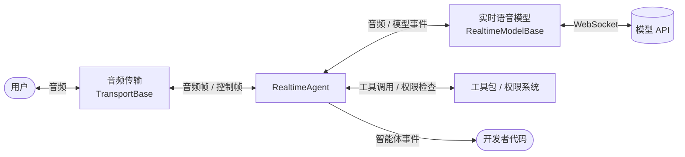

语音到语音（Speech-to-Speech）方案是指音频直接进出一个端到端的语音模型：语音识别、理解与合成全部在模型内部完成。与基于轮次进行交互的方式相比，它不需要等用户说完再逐级处理，延迟更低，能保留语气与情绪，用户也可以随时打断。

AgentScope 通过 `RealtimeAgent` 实现该方案，支持：

- **回合检测**：支持由模型 API 判断用户何时说完，也支持传入本地 VAD 自行判断
- **打断**：支持用户开口即打断当前回复，上下文只保留用户实际听到的部分，也支持由代码主动打断
- **工具调用与用户确认**：支持 `Toolkit` 与权限系统，确认过程中语音流不中断
- **文本输入**：支持在语音对话中直接发送文字（需模型支持文本输入）
- **断线自动恢复**：模型 API 因空闲或超时关闭会话后，用户再次输入时自动重连并恢复会话
- **回合整理**：支持合并被停顿切开的句子，过滤没有实际内容的应答

目前支持的模型 API 与模型如下，每个模型类使用所属 API 的凭证，用法与其它模型一致：

| 模型 API | 模型类 | 支持的模型 |
|----------|--------|------------|
| DashScope（Qwen-Omni） | `DashScopeRealtimeModel` | `qwen3.5-omni-plus-realtime`<br/>`qwen3.5-omni-flash-realtime`<br/>`qwen3-omni-flash-realtime`<br/>`qwen-omni-turbo-realtime` |
| DashScope（Qwen-Audio-3.0） | `DashScopeAudioRealtimeModel` | `qwen-audio-3.0-realtime-plus`<br/>`qwen-audio-3.0-realtime-flash` |
| OpenAI Realtime | `OpenAIRealtimeModel` | `gpt-realtime-2.1`<br/>`gpt-realtime-2.1-mini`<br/>`gpt-realtime-2`<br/>`gpt-realtime-1.5` |
| Gemini Live | `GeminiRealtimeModel` | `gemini-3.1-flash-live-preview`<br/>`gemini-2.5-flash-native-audio-preview-12-2025` |
| xAI Grok Voice | `XAIRealtimeModel` | `grok-voice-latest`<br/>`grok-voice-think-fast-2.0` |

<Tip>
调用模型类的 `list_models()` 可以拿到该 API 下所有模型的[模型卡片](/versions/2.0.8/zh/building-blocks/model/overview#什么是模型卡片)，其中包含采样率、上下文上限、可选音色等信息，可直接用于渲染前端的模型选择器。
</Tip>

## 核心概念

语音到语音智能体由三个组件组成：

- 音频传输（`TransportBase`）：负责声音的来源与去向，例如本地声卡或浏览器
- 实时语音模型（`RealtimeModelBase`）：负责与模型 API 的会话，把协议消息翻译成统一的模型事件
- `RealtimeAgent`：负责在两者之间维护对话回合，处理打断、工具调用与事件产出

下图展示了音频与事件在三者之间的流向：



三个组件的职责如下：

| 组件 | 负责 |
|------|------|
| `RealtimeAgent` | 划分回合、打断与上下文截断、工具调用与用户确认、产出智能体事件、模型断线后重连 |
| 实时语音模型（`RealtimeModelBase`） | 维护 WebSocket 会话，把协议消息翻译成统一的模型事件，声明采样率与能力 |
| 音频传输（`TransportBase`） | 采集与播放、统计播放进度、打断时淡出、把客户端的控制帧转成对智能体的调用 |

其中实时语音模型和音频传输模块支持从基类进行拓展，用以适配新的模型 API，或接入浏览器等其它客户端。

## 快速开始

首先安装实时语音的可选依赖，其中包含 WebSocket 客户端与本地声卡库：

```bash 安装实时语音依赖
pip install "agentscope[realtime]"
```

<Note>
本地声卡库 `sounddevice` 依赖 PortAudio。macOS 与 Windows 已随包附带；Debian/Ubuntu 需要先执行 `apt install libportaudio2`。
</Note>

下面用本地麦克风搭一个能对话、能被打断的语音智能体，分四步完成：

<Steps>
  <Step title="初始化实时语音模型">
    模型类接收模型名与所属 API 的凭证，模型卡片按名称自动匹配，采样率与上下文限制随之确定。音色、回合检测方式等可调项通过 `Parameters` 传入。下面的 tab 分别展示四种模型 API 的初始化方式，后续三步与选用哪种模型无关：

    <CodeGroup>
    ```python DashScope Qwen-Audio-3.0
    import os

    from agentscope.credential import DashScopeCredential
    from agentscope.realtime import DashScopeAudioRealtimeModel

    model = DashScopeAudioRealtimeModel(
        model="qwen-audio-3.0-realtime-plus",
        credential=DashScopeCredential(api_key=os.environ["DASHSCOPE_API_KEY"]),
        parameters=DashScopeAudioRealtimeModel.Parameters(voice="longanqian"),
    )
    ```

    ```python DashScope Qwen-Omni
    import os

    from agentscope.credential import DashScopeCredential
    from agentscope.realtime import DashScopeRealtimeModel

    model = DashScopeRealtimeModel(
        model="qwen3.5-omni-plus-realtime",
        credential=DashScopeCredential(api_key=os.environ["DASHSCOPE_API_KEY"]),
        parameters=DashScopeRealtimeModel.Parameters(voice="Tina"),
    )
    ```

    ```python OpenAI
    import os

    from agentscope.credential import OpenAICredential
    from agentscope.realtime import OpenAIRealtimeModel

    model = OpenAIRealtimeModel(
        model="gpt-realtime-2.1",
        credential=OpenAICredential(api_key=os.environ["OPENAI_API_KEY"]),
        parameters=OpenAIRealtimeModel.Parameters(voice="marin"),
    )
    ```

    ```python Gemini
    import os

    from agentscope.credential import GeminiCredential
    from agentscope.realtime import GeminiRealtimeModel

    model = GeminiRealtimeModel(
        model="gemini-3.1-flash-live-preview",
        credential=GeminiCredential(api_key=os.environ["GEMINI_API_KEY"]),
        parameters=GeminiRealtimeModel.Parameters(voice="Puck"),
    )
    ```

    ```python xAI
    import os

    from agentscope.credential import XAICredential
    from agentscope.realtime import XAIRealtimeModel

    model = XAIRealtimeModel(
        model="grok-voice-latest",
        credential=XAICredential(api_key=os.environ["XAI_API_KEY"]),
        # reasoning_effort 设为 "none" 可以换取更快但更浅的回答
        parameters=XAIRealtimeModel.Parameters(voice="eve", reasoning_effort="high"),
    )
    ```
    </CodeGroup>
  </Step>

  <Step title="创建智能体">
    智能体持有模型会话，系统提示在连接模型时一次性发送：

    ```python 创建智能体
    from agentscope.agent import RealtimeAgent

    agent = RealtimeAgent(
        name="Friday",
        system_prompt="你是一个中文语音助手，回答尽量简短。",
        model=model,
    )
    ```
  </Step>

  <Step title="创建音频传输">
    传输决定声音的来源与去向，`LocalAudioTransport` 使用本机的麦克风与扬声器。采样率必须与模型一致，因此直接用模型的属性构造，而不是写死数值：

    ```python 创建音频传输
    from agentscope.realtime import LocalAudioTransport

    transport = LocalAudioTransport(
        input_sample_rate=model.input_sample_rate,
        output_sample_rate=model.output_sample_rate,
    )
    ```
  </Step>

  <Step title="运行对话">
    `reply_stream()` 借用传输持续泵送音频，并以异步迭代器的形式产出事件。用户说话同样以一次回复的形式产出事件，`role` 为 `"user"`，因此下面用 `reply_id` 区分两边，把双方说的话打印到终端：

    ```python 运行对话并打印双方的话
    from agentscope.event import ReplyEndEvent, ReplyStartEvent, TextBlockDeltaEvent

    user_turns: set[str] = set()

    async with agent, transport:
        async for event in agent.reply_stream(transport):
            match event:
                case ReplyStartEvent(role="user"):
                    user_turns.add(event.reply_id)
                case ReplyStartEvent():
                    print(f"[{agent.name}] ", end="", flush=True)
                case TextBlockDeltaEvent() if event.reply_id in user_turns:
                    print(f"[user] {event.delta}")
                case TextBlockDeltaEvent():
                    print(event.delta, end="", flush=True)
                case ReplyEndEvent() if event.reply_id not in user_turns:
                    print(f"  ({event.finished_reason})")
    ```

    运行后对着麦克风说话即可听到回复，在回复过程中开口即可打断，按 Ctrl+C 退出。
  </Step>
</Steps>

上面的例子里有三个生命周期，各自由不同的对象掌控：

| 对象 | 持有者 | 生命周期 |
|------|--------|----------|
| 模型会话 | `RealtimeAgent` | `async with agent` 期间，或手动调用 `connect()` 与 `close()` 之间；模型 API 关闭会话后会在下一句话时自动重连 |
| 音频传输 | 开发者 | `async with transport` 期间；智能体只借用，不会替开发者关闭 |
| 一次运行 | `agent.reply_stream(transport)` | 从传输开始产出音频，到传输的输入结束；期间可以有任意多轮对话 |

三者分开的好处是客户端断开重连时不丢失模型会话，模型会话超时时也不影响传输。同一个智能体可以在传输更换后再次调用 `reply_stream()`，对话历史仍在 `agent.state` 中。

## 使用智能体

`RealtimeAgent` 的构造参数如下：

<ParamField path="name" type="str" required>
  智能体名称，会写入智能体消息与事件。
</ParamField>

<ParamField path="system_prompt" type="str" required>
  系统提示，在连接模型时一次性发送，工具包中技能的说明会附加在后面。
</ParamField>

<ParamField path="model" type="RealtimeModelBase" required>
  实时语音模型，支持的模型见上方表格。
</ParamField>

<ParamField path="toolkit" type="Toolkit | None" default="None">
  模型可以调用的工具包，工具在智能体侧执行并经过权限检查。
</ParamField>

<ParamField path="state" type="AgentState | None" default="None">
  对话历史、权限规则与工具上下文，省略时新建。
</ParamField>

<ParamField path="vad" type="VADBase | None" default="None">
  本地语音活动检测。传入后由它决定回合边界，模型 API 自身的回合检测会被关闭，详见[回合检测](#回合检测)。
</ParamField>

<ParamField path="aggregator" type="TurnAggregator | None" default="None">
  回合整理器，负责合并被切开的句子与过滤无内容应答，省略时使用默认配置。
</ParamField>

`RealtimeAgent` 的核心方法如下：

| 方法 | 作用 |
|------|------|
| `connect()` / `close()` | 打开与关闭模型会话，`async with agent` 等价于两者 |
| `reply_stream(transport)` | 借用一个传输，持续泵送音频并产出智能体事件，直到传输结束 |
| `send(inputs)` | 发送音频以外的输入：文字、工具调用的确认结果、打断 |
| `interrupt()` | 打断当前回复 |

### 运行并处理事件

`reply_stream()` 接收一个已经启动的传输，持续把音频送给模型，并以异步迭代器的形式产出事件，直到传输的输入结束。传输由开发者持有，`reply_stream()` 结束时不会关闭它，同一个智能体可以换一个传输再次运行。

`reply_stream()` 产出的是与 `Agent.reply_stream` 相同的[智能体事件](/versions/2.0.8/zh/building-blocks/message-and-event)，因此为文字智能体编写的事件处理逻辑可以直接复用。用户说话也被当作一次回复来报告：开口时发出 `role` 为 `"user"` 的 `ReplyStartEvent`，说完时发出 `ReplyEndEvent`，转写确定后再以文本块事件送出，因此外层可以用同一套逻辑把用户和智能体的事件各自拼成消息。模型音频则以数据块事件的形式产出：

| 事件 | 含义 |
|------|------|
| `ReplyStartEvent` / `ReplyEndEvent` | 一次回复的开始与结束。`role` 为 `"user"` 时表示用户开口与说完；智能体回复的 `finished_reason` 为 `completed`、`interrupted` 或 `error` |
| `TextBlockDeltaEvent` | 文本增量：智能体回复的转写，或用户这一轮说话的转写 |
| `DataBlockDeltaEvent` | 回复音频的增量数据，已由传输播放，通常无需处理 |
| `ToolCallStartEvent` / `ToolCallEndEvent` | 模型发起的工具调用 |
| `ToolResultStartEvent` / `ToolResultEndEvent` | 工具执行的结果 |
| `RequireUserConfirmEvent` | 工具调用需要用户确认 |

### 发送输入

在支持文本输入的模型上，可以用 `send()` 在语音对话中发送文字。文字会先打断当前回复，再作为一轮用户输入交给模型，回复仍以语音播放：

```python 发送文字输入
await agent.send("帮我查一下今天的天气")
```

`send()` 接收的输入类型与 `Agent.reply` 对齐：

| 输入 | 作用 |
|------|------|
| `str` 或 `Msg` | 一轮文字输入，仅支持文本输入的模型可用，否则抛出 `NotImplementedError` |
| `UserConfirmResultEvent` | 工具调用的确认结果 |
| `UserInterruptEvent` | 打断当前回复，等价于 `interrupt()` |

<Note>
`DashScopeRealtimeModel`（Qwen-Omni）的模型 API 不接受文本轮次，其余模型类均支持文本输入，可通过模型类的 `supports_text_input` 属性判断。
</Note>

### 打断

用户在回复播放期间开口，智能体会立即停止播放并取消模型侧的回复。传输会报告实际播放到的位置，智能体据此把上下文中的智能体消息截到用户真正听到的部分，避免模型"以为"用户听完了整句话。开发者也可以在代码中主动打断，例如响应界面上的停止按钮：

```python 主动打断当前回复
await agent.interrupt()
```

被打断的回复以 `finished_reason` 为 `interrupted` 的 `ReplyEndEvent` 结束。由于文本增量比音频先到，前端此时已经收到了多于用户实际听到的文字，因此该文本块的 `TextBlockEndEvent` 会带上 `text` 字段给出最终文本，用 `Msg.append_event` 拼消息时会自动覆盖，自行拼接的前端需要用它替换该块的内容。

智能体侧的上下文一定会被截断，模型侧则取决于模型 API 的协议，由模型类的 `truncation` 属性标明：

| `truncation` | 模型 API | 模型侧的处理 |
|--------------|----------|--------------|
| `EXPLICIT` | OpenAI Realtime | 接受截断指令，模型侧上下文与用户听到的内容一致 |
| `SERVER` | Gemini Live | 模型 API 自行处理打断，无需发送截断指令 |
| `NONE` | DashScope、xAI Grok Voice | 不接受截断指令，模型侧仍保留完整的回复 |

### 调用工具

传入 `toolkit` 后，模型可以在对话中调用工具。工具在智能体侧执行，权限检查、用户确认与[普通智能体](/versions/2.0.8/zh/building-blocks/agent/human-in-the-loop)一致。区别在于实时语音智能体不会暂停：需要确认时，`reply_stream()` 产出 `RequireUserConfirmEvent` 后继续产出其它事件，确认结果由开发者在任意时刻通过 `send()` 送回，与事件流本身解耦：

```python 装配工具并接收确认请求
from agentscope.event import RequireUserConfirmEvent
from agentscope.tool import Bash, Read, Toolkit

agent = RealtimeAgent(
    name="Friday",
    system_prompt="...",
    model=model,
    toolkit=Toolkit(tools=[Bash(), Read()]),
)

async with agent, transport:
    async for event in agent.reply_stream(transport):
        if isinstance(event, RequireUserConfirmEvent):
            # 把确认请求交给界面，不要在这里阻塞事件流
            show_confirm_dialog(event)
```

用户作出选择后，把 `UserConfirmResultEvent` 送回智能体即可，调用位置可以是界面回调、WebSocket 消息处理函数或终端输入。下面的 tab 分别展示两种场景：

<CodeGroup>
```python 界面回调
from agentscope.event import ConfirmResult, UserConfirmResultEvent


async def on_confirm_clicked(event: RequireUserConfirmEvent, allowed: bool) -> None:
    # 由按钮点击等界面事件触发，与 reply_stream() 的循环无关
    await agent.send(
        UserConfirmResultEvent(
            reply_id=event.reply_id,
            confirm_results=[
                ConfirmResult(tool_call=call, confirmed=allowed)
                for call in event.tool_calls
            ],
        ),
    )
```

```python 终端输入
import asyncio

from agentscope.event import ConfirmResult, UserConfirmResultEvent


async def confirm_in_terminal(event: RequireUserConfirmEvent) -> None:
    loop = asyncio.get_running_loop()
    results = []
    for call in event.tool_calls:
        # 终端输入会阻塞线程，放到线程池里执行，等待期间音频不停
        answer = await loop.run_in_executor(
            None, input, f"允许 {call.name}({call.input})? [y/N] ",
        )
        results.append(
            ConfirmResult(tool_call=call, confirmed=answer.lower() == "y"),
        )
    await agent.send(
        UserConfirmResultEvent(reply_id=event.reply_id, confirm_results=results),
    )
```
</CodeGroup>

使用工具时需要注意以下几点：

- 只有模型卡片标注 `supports_tools` 的模型才会收到工具列表，DashScope 的 Qwen-Omni 系列中仅 qwen3.5 系列支持，其余模型 API 的模型均支持。
- 确认请求超过 5 分钟没有回应，智能体按拒绝处理。

<Tip>
实时语音智能体目前不支持元工具（工具分组）：工具列表与系统提示在连接模型时一次性发送，会话中途激活工具组或添加工具不会生效，请在构造时把需要的工具全部放进工具包。
</Tip>

### 回合检测

回合检测决定"用户什么时候说完了"，只能由一方负责。默认情况下由模型 API 负责，智能体只响应它上报的说话开始与结束；传入 `vad` 参数后改由智能体本地判断，并自动关闭模型 API 侧的回合检测。两种模式的对比如下：

| 模式 | 配置方式 | 适用场景 |
|------|----------|----------|
| 模型 API 检测 | 不传 `vad`，通过 `Parameters.turn_detection` 选择检测方式 | 默认选择，无需额外模型 |
| 本地检测 | 传入 `VADBase` 实现 | 需要自定义端点策略，或模型 API 不提供回合检测 |

各模型 API 的 `turn_detection` 取值不同，敏感度、静音时长等参数同样在 `Parameters` 中：

| 模型 API | `turn_detection` 取值 |
|----------|------------------------|
| DashScope（Qwen-Omni） | `server_vad`、`semantic_vad`、`none` |
| DashScope（Qwen-Audio-3.0） | `server_vad`、`smart_turn`、`none` |
| OpenAI Realtime | `server_vad`、`semantic_vad`、`none` |
| Gemini Live | `automatic`、`none` |
| xAI Grok Voice | `server_vad`、`none` |

本地检测需要实现 `VADBase`：`push()` 接收传输送来的每一块 PCM16 音频，只在说话开始或结束的那一块返回 `SpeechTransition`，其余时候返回 `None`；`reset()` 在音频流出现间断（例如重连）时清空内部状态。传入 `vad` 后智能体会把 `turn_detection` 置为 `none`，无需手动设置：

```python 接入本地 VAD
from agentscope.realtime import SpeechTransition, VADBase


class MyVAD(VADBase):
    sample_rate = 16000  # 必须与传输的输入采样率一致

    def push(self, pcm: bytes) -> SpeechTransition | None:
        # 在说话开始的那一块返回 STARTED，结束的那一块返回 ENDED
        ...

    def reset(self) -> None:
        ...


agent = RealtimeAgent(name="Friday", system_prompt="...", model=model, vad=MyVAD())
```

无论哪种模式，模型 API 上报或本地检测到的用户转写都会先经过 `TurnAggregator` 整理，再写入上下文：

```python 配置回合整理
from agentscope.agent import RealtimeAgent, TurnAggregator

agent = RealtimeAgent(
    name="Friday",
    system_prompt="...",
    model=model,
    aggregator=TurnAggregator(
        merge_window_ms=800,                    # 上一轮结束后 800 毫秒内的转写并入上一轮
        backchannels=frozenset({"嗯", "好的"}),  # 这些应答不构成一轮
        min_chars=1,                            # 短于该长度的转写丢弃
    ),
)
```

### 断线自动恢复

模型 API 都会主动关闭会话，只是触发条件不同：DashScope 的空闲超时约为三分钟，Gemini Live 的音频会话上限约为 15 分钟，OpenAI Realtime 约为 1 小时。智能体把这视为正常情况：记录一条 INFO 日志，保持传输打开，用户下一次说话时自动重连并补发这期间的音频。对话历史保存在 `agent.state` 中，重连时智能体会把此前的对话转写附在系统提示之后发给模型，因此模型能接上之前的话题。

<Tip>
长时间静默或长对话都是安全的，不需要为会话超时做任何处理。若要在客户端断开后继续同一场对话，保持智能体不关闭，换一个传输再次调用 `reply_stream()` 即可。
</Tip>

## 音频传输

音频传输负责"声音从哪里来、到哪里去"，智能体不关心音频来自本地声卡还是浏览器。AgentScope 当前提供以下传输：

| 传输 | 说明 |
|------|------|
| `LocalAudioTransport` | 本地麦克风与扬声器，基于 `sounddevice`，适合本机调试 |
| 浏览器传输 | 即将上线 |

### 本地声卡

`LocalAudioTransport` 支持以下参数：

<ParamField path="input_sample_rate" type="int" default="16000">
  采集采样率，必须等于模型的 `input_sample_rate`。
</ParamField>

<ParamField path="output_sample_rate" type="int" default="24000">
  播放采样率，必须等于模型的 `output_sample_rate`。
</ParamField>

<ParamField path="input_device" type="int | str | None" default="None">
  输入设备的编号或名称，省略时使用系统默认设备。
</ParamField>

<ParamField path="output_device" type="int | str | None" default="None">
  输出设备的编号或名称，省略时使用系统默认设备。
</ParamField>

<ParamField path="chunk_ms" type="int" default="100">
  每块上行音频的时长。
</ParamField>

<ParamField path="fade_ms" type="int" default="30">
  打断时对正在播放的音频施加的淡出时长，避免爆音。
</ParamField>

各模型 API 的采样率并不一致（DashScope 上行 16 kHz，OpenAI 与 xAI 上行 24 kHz），因此推荐直接用模型的属性构造传输，而不是写死数值。默认设备不合适时，可以用 `sounddevice` 列出设备并按编号指定：

```bash 列出音频设备
python -m sounddevice
```

使用本地声卡时有几点建议：

- **佩戴耳机。** 使用外放时麦克风会录到智能体自己的声音，回合检测把它当成用户开口，智能体会打断自己。`LocalAudioTransport` 不做回声消除。
- **不要让同一个蓝牙耳机同时负责输入和输出。** macOS 会把 AirPods 等设备切换到免提模式，此时经常没有声音。可以把耳机麦克风与内置扬声器搭配使用，例如 `LocalAudioTransport(input_device=3, output_device=2)`。

### 自定义传输

接入浏览器或其它音频来源时，继承 `TransportBase` 并实现以下方法：

| 方法 | 作用 |
|------|------|
| `start()` / `close()` | 打开与关闭音频设备或连接 |
| `incoming()` | 异步迭代器，产出上行的 `AudioFrame`（PCM16 音频）与 `ControlFrame`（文本、确认等控制帧） |
| `send_audio(pcm, item_id)` | 播放一块模型音频，`item_id` 标识它属于哪条回复 |
| `clear_audio()` | 打断时丢弃未播放的音频，并返回 `PlayoutPosition`，其中 `played_ms` 是这条回复实际播放到的毫秒数 |
| `playout` | 属性，当前的播放位置 |

`clear_audio()` 返回的播放位置是截断上下文的依据，因此播放进度的统计应尽量靠近扬声器，浏览器中应放在 AudioWorklet 里。
