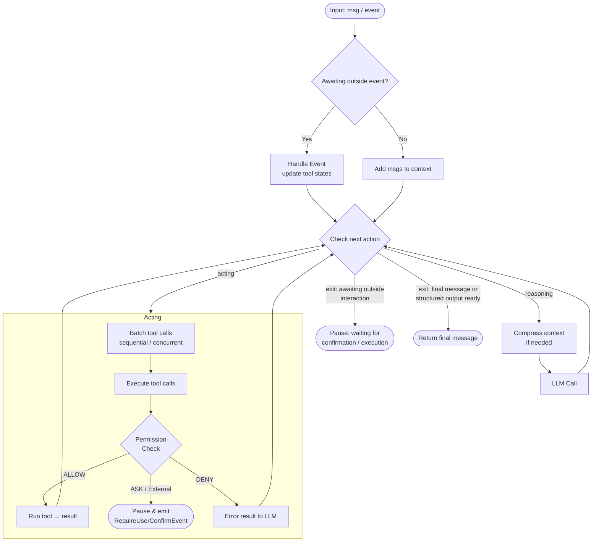

`Agent` is the core abstraction in AgentScope: a **stateless** reasoning-acting loop engine that integrates models, tools, the permission system, human-in-the-loop, context management, middlewares, state management, and the event system into a single unified interface.

Its primary responsibilities are:

- Accepting input messages or events, invoking tools to complete tasks
- Generating structured output that conforms to a user-provided schema
- Managing context, including context compression and offloading
- Staying aware of the changing environment (time, tasks, context usage) via runtime state injection
- Executing middleware hooks at key lifecycle stages for custom logic
- Automatically managing concurrent and sequential tool execution
- Handling user interruptions and continuing from paused states

## Core Interfaces

The main interfaces of the `Agent` class are as follows:

| Method                                                     | Description                                                                                        |
|------------------------------------------------------------|----------------------------------------------------------------------------------------------------|
| `reply(inputs, structured_schema)`                         | Run the reasoning-acting loop and return the final `Msg`, optionally enforcing a structured output |
| `reply_stream(inputs, structured_schema, yield_final_msg)` | Same as `reply`, but yields `AgentEvent` objects as they are produced                              |
| `observe(msgs)`                                            | Add messages to context without triggering reasoning                                               |
| `compress_context(context_config, instructions)`           | Compress the context if token count exceeds the threshold, optionally guided by injected instructions |

## Main Loop

The agent runs a reasoning-acting loop on every `reply` call. Each round, a single decision point inspects the current state and chooses the next action (reasoning, acting, or exit). The diagram below shows the main control flow.

## Next Steps

<CardGroup cols={2}>
  <Card title="Configure Agent" icon="gear" href="/versions/2.0.9dev/en/building-blocks/agent/configure-agent">
    How to set up models, formatters, tools, and configs.
  </Card>
  <Card title="Run Agent" icon="play" href="/versions/2.0.9dev/en/building-blocks/agent/run-agent">
    How to reply, stream, require structured output, and persist state.
  </Card>
  <Card title="Environment Awareness" icon="clock" href="/versions/2.0.9dev/en/building-blocks/context/environment-awareness">
    How the agent stays aware of time, tasks, and context usage.
  </Card>
  <Card title="Interrupt Agent" icon="hand" href="/versions/2.0.9dev/en/building-blocks/agent/interrupt-agent">
    How to stop a running or paused agent cleanly.
  </Card>
  <Card title="Human-in-the-Loop" icon="user-check" href="/versions/2.0.9dev/en/building-blocks/agent/human-in-the-loop">
    How to pause for user confirmation or external execution.
  </Card>
</CardGroup>
