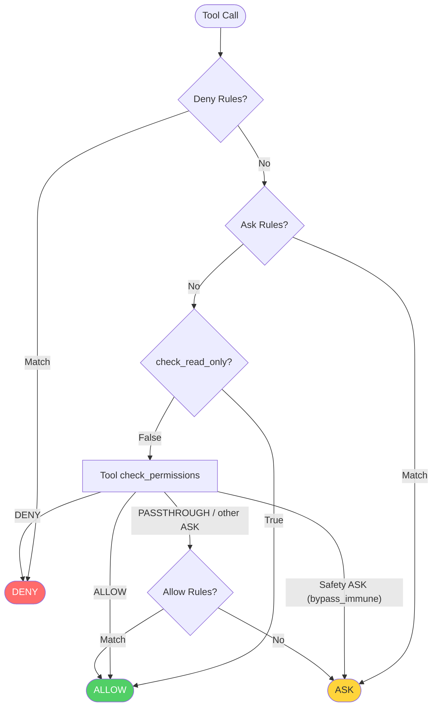
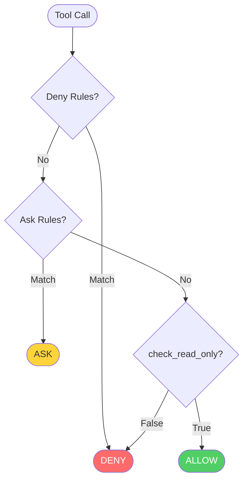
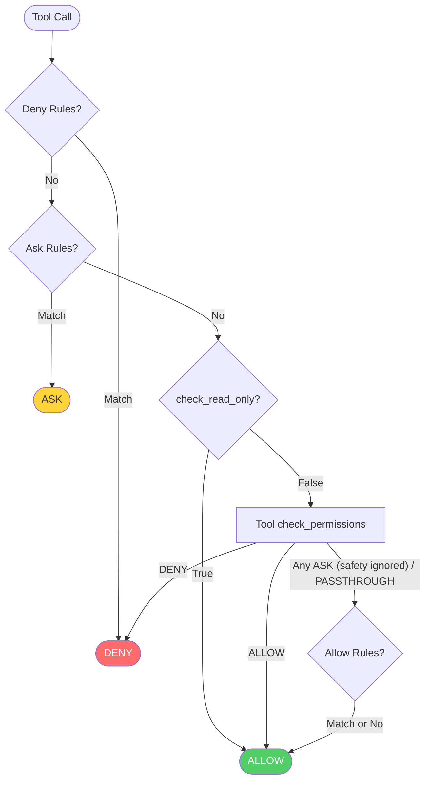
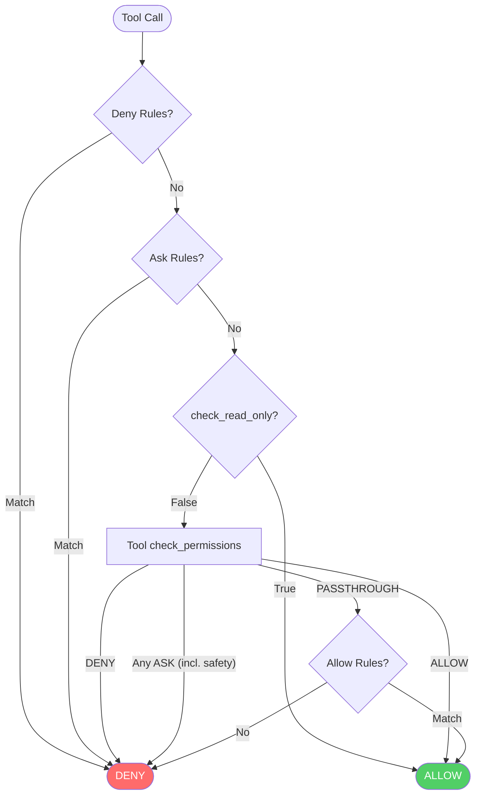

A permission mode is the global policy behind every tool-call decision: it selects which decision points are active and what happens to calls nothing else resolves. AgentScope supports five modes, each suited to a different deployment scenario:

| Mode | Behavior | Use Case |
|------|----------|----------|
| `DEFAULT` | Read-only invocations are auto-allowed (`Read` / `Glob` / `Grep`, and read-only Bash commands like `ls`, `git status`, `cat`, ...); everything else prompts unless an allow rule matches. Safety ASKs cannot be overridden by allow rules | Most secure, recommended default |
| `ACCEPT_EDITS` | Everything `DEFAULT` allows, **plus** edits within a working directory are auto-allowed without prompting: `Write` / `Edit` on files under a configured working directory, and Bash filesystem commands (`mkdir`/`touch`/`rm`/`cp`/`mv`/`sed`) **when every target path resolves inside a working directory** | Active development with user present |
| `EXPLORE` | Read-only operations allowed; all modifications denied. Allow rules and the tool's safety checks are not consulted: the read-only guarantee cannot be granted away by a rule. User-configured DENY/ASK rules still take precedence over the read-only auto-allow | Code exploration, planning |
| `BYPASS` | Fully trusted: deny/ask rules and tool DENYs still apply, but **tool safety ASKs are skipped** (`rm -rf /`, writes to `~/.bashrc`, command injection, etc. all pass through) and everything else is allowed. Use deny rules to protect specific paths | Sandboxed environments or fully trusted runs |
| `DONT_ASK` | The unattended counterpart of `ACCEPT_EDITS`: read-only auto-allowed, working-directory edits auto-allowed, but anything that would otherwise prompt the (absent) user is **DENIED** instead of asked. Never returns ASK | Unattended / scheduled execution |

## Set the Mode

Set the mode via `AgentState.permission_context` when creating the agent, or update it at runtime:

<CodeGroup>
```python At initialization
from agentscope.agent import Agent
from agentscope.state import AgentState
from agentscope.permission import PermissionContext, PermissionMode

agent = Agent(
    name="my_agent",
    system_prompt="...",
    model=model,
    state=AgentState(
        permission_context=PermissionContext(
            mode=PermissionMode.DEFAULT,
        )
    ),
)
```

```python At runtime
# Switch to read-only mode on the fly
agent.state.permission_context.mode = PermissionMode.EXPLORE

# Switch to unattended mode for batch execution
agent.state.permission_context.mode = PermissionMode.DONT_ASK
```

```python ACCEPT_EDITS with working directory
from agentscope.permission import AdditionalWorkingDirectory

agent = Agent(
    name="my_agent",
    system_prompt="...",
    model=model,
    state=AgentState(
        permission_context=PermissionContext(
            mode=PermissionMode.ACCEPT_EDITS,
            working_directories={
                "/my/project": AdditionalWorkingDirectory(
                    path="/my/project",
                    source="userSettings",
                )
            },
        )
    ),
)
```
</CodeGroup>

## Decision Flow per Mode

Every mode walks the decision points summarized in the [decision matrix](/versions/2.0.9dev/en/building-blocks/permission-system/overview#decision-matrix); the flowcharts below expand each mode into its full decision flow. ASK outcomes trigger user confirmation; if the user accepts the auto-generated suggested rule, it is persisted for future calls.

<Tabs>
  <Tab title="DEFAULT">

  </Tab>
  <Tab title="EXPLORE">

  </Tab>
  <Tab title="ACCEPT_EDITS">

  </Tab>
  <Tab title="BYPASS">

  </Tab>
  <Tab title="DONT_ASK">

  </Tab>
</Tabs>

<Note>
**Deny rules** and **explicit ask rules** are always honored, in every mode (including `BYPASS`).

**Tool-emitted safety ASKs** (`bypass_immune=True`) are honored in `DEFAULT`, `ACCEPT_EDITS`, and `DONT_ASK`; they cannot be silenced by allow rules. In `BYPASS` mode they are skipped on purpose: BYPASS's contract is "the user has opted out of safety prompts; only deny/ask rules remain as guardrails." See the [safety check contract](/versions/2.0.9dev/en/building-blocks/permission-system/tool-check#safety-check-contract).
</Note>
